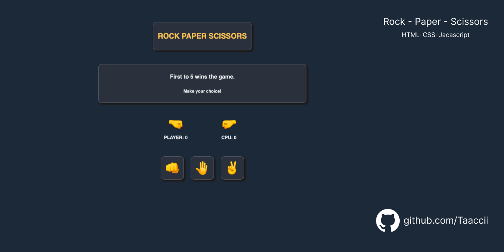

# Rock Paper Scissors

> Classic hand game with animated UI and score tracking.

---

## 🔗 Live Demo

**Live Demo:** [taaccii.github.io/rock-paper-scissors](https://taaccii.github.io/rock-paper-scissors/)

---

## ✨ Features

- **First to 5 wins** — progressive score tracking across rounds
- **Animated UI** — visual feedback on every move
- **CPU opponent** — randomized computer choices
- **Responsive** — works on desktop and mobile

---

## 🛠️ Tech Stack

| Component | Technology |
|-----------|------------|
| **Markup** | HTML5 |
| **Style** | CSS3 |
| **Logic** | JavaScript ES6+ |

---

## 💡 What I Learned

- Breaking a problem into subproblems and mapping them to functions
- Managing game state across multiple rounds with user input
- Reworking a console-based project into a full DOM interface
- Applying responsive design with CSS media queries

---

## 📝 Notes

Started as a pure JavaScript console game, then reworked from scratch after learning DOM manipulation. Planning with pseudocode and diagrams before writing a single line of code made the whole process smoother — especially splitting the work across multiple sessions.

---

## 📄 License

This project is licensed under the **MIT License** — see [`LICENSE`](./LICENSE) for details.

---

## 👨‍💻 Author

**TacciDev**

- 📧 [taccidev@gmail.com](mailto:taccidev@gmail.com)
- 🐙 GitHub: [@Taaccii](https://github.com/Taaccii)
- 💼 LinkedIn: [alessandro-barletta-dev](https://linkedin.com/in/alessandro-barletta-dev)

---

> *Project built as part of [The Odin Project](https://www.theodinproject.com) Foundations curriculum.*